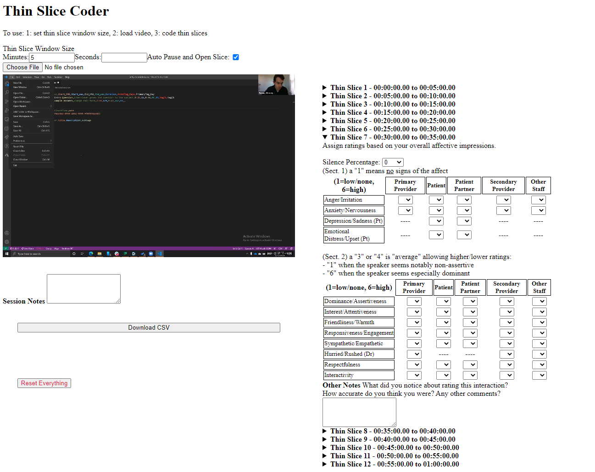

# Thin Slice Coder

The Thin Slice Coder is a tool for quick Global Affect Rating thin slice coding of multimedia data. Inspired by [RIAS](https://pubmed.ncbi.nlm.nih.gov/11932123/), you can load in a video or audio file (tested on Chromium, which supports .mp4, .mov, .mpeg4, .ogg, .webm, and .wav) and then code thin slices of media.

To use:
- Load a media file
- Input the size of the thin slice window desired (the number of thin slices is based on the length of your media and this value), for example 5 minute slices of 32 minute video would be 7 slices)
- Play the media file
- If you check "Auto Pause and Open Slice" the media will pause at the end of the each thin slice and open the relevant coder.

When finished you can export data as a CSV file.

Optionally you can open and close the thin slice coder at will.

There is also a session notes text box for any summative information input.
